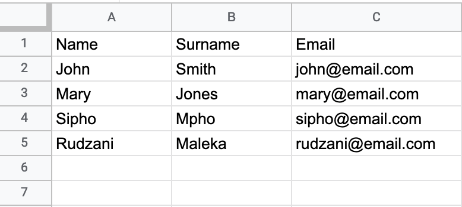

[< Back to overview](README.md)

# Data Journalism Newsletters

For now there are six newsletter in this series though more may be added aver time. [[todo: add newsletter subscription link](Issues.md)]

**Purpose**: A series of six newsletters sent asynchronously to subscribers when they sign up. The newsletters introduce the idea of data journalism, some of the ways to get started with data journalism, and some of the tools of the trade. The guide is intended as a starting point for data journalism.

**What this is not**: This is not a comprehensive guide to data journalism. Nor is it a hands-on tutorial to doing data journalism.

**Tone**: The guide series is light, easily read and personal.

---

#### Newsletter 1

## Introduction :email:

Welcome to the first in a series of newsletters about getting started with data journalism from [The Outlier](https://theoutlier.co.za). You probably already know this but just to make sure:

- There are six newsletters in this series.
- One newsletter will be sent out every week from the time you subscribe.
- Each newsletter will cover a specific area of data journalism, roughly these areas:

  1 - What/why is data journalism? (this email)
  2 - The basic tools of data journalism
  3 - How to find data for projects
  4 - Why and how you should "clean" data
  5 - The basics of analysing data and finding an angle
  6 - Getting started with data visualisation

That's a lot of ground to cover in over just six weeks, so we won't be able to go into great detail on each of these areas but our intention is that it will be enough to help you get started with data journalism and to become familiar with the core concepts. Later on in the series we'll look at some resources that you can look at to start expanding your skills.

**:exclamation:But first, an important note**: This is an evolving course. Over time we will be updating it with new information and techniques if we think they will improve the overall course. If you have any questions or suggestions, or things that you think we didn't explain well enough, please let us know so we can improve explanations or add in things we left out. You can email us at [ddjnewsletter@theoutlier.co.za](mailto:ddjnewsletter@theoutlier.co.za). Any and all feedback is hugely welcomed. Alternatively, join our [Outlier Discord channel](https://discord.gg/Qf9AkFeXEF) and talk with us there.

Also, see the foot of this email for more information and contacts.

## What is data journalism? :bar_chart: :chart_with_upwards_trend:

Data journalism is a lot of different things to a lot of different people but boradly speaking it is the practice of doing journalism using, mostly, data. Perhaps the easiest way to describe data journalism is that it is journalism in which data is very often the subject of reasearch or the "interviewee". This differs from traditional jounalism which tends to report of events and interviews people.

This is not to say data journalism isn't about people, it most often is, but it generally approaches the issues of the day from the perspective of data. For example, a story on elections might compare the elections of the past few years while traditional journalism might report on the speeches made by candidates. Traditional journalism might write a story about school systems by interviewing pupils, teachers and administrators while a data journalist may analyse school infrastructure reports looking for patterns.

Data journalism is not really all that different from "normal" journalism. In traditional journalism a journalist will build relationships with "sources" so they are informed of when things happen or change. A data journalist may do the same by tracking data around a particular issue over time to see how things change.

Data journalism is a relatively new field of work and there are some misconceptions about what it is and what it isn't. Here are a few of those myths and misunderstandings:

- Data journalism is divorced of emotion. This is not necessarily true. Data very often represents people and, in many cases, their struggles. Understanding data about unemployment, gender-based violence, homelessness from example often allows us to tell a more compelling story that simply quoting relevant officials.

- Data journalism is hard. Data journalism can be very hard. But then so is finding that perfect interview or video shot to tell most other stories. Don't be fooled, like most things, doing any form of journalism is hard if done properly, and data journalism is no exception.

- Data journalism is full of maths. This is only partially true. It's true that while a good grasp of maths and statistics can often help it is far from required. There are some basic maths that you ought to know but almost all of it you probably already know or you can learn quickly.

- Data journalism is all about graphics and visualisations. This is perhaps the biggest mistake that most people make, though understandably so. Most of the high-profile examples we see of data journalism include some form of visualisation. But this doesn't always have to be the case. Good data journalism can simply be the foundations for a well-written story or investigation. If the data is good enough it's possible to add in a visualisation to helop tell the story but it's absolutely not essential.

## Where to next? :open_file_folder:

In the next five newsletters we'll cover many of the skills you need to know about to do data journalism but until then there are a number of places to learn more or get involved. Some of these include:

#### Guides :book:

- [The Data Journalism Handbook 2](https://datajournalism.com/read/handbook/two)
- [AlJazeera Data Journalism Handbook](https://institute.aljazeera.net/en/publications) (Download as [PDF](https://institute.aljazeera.net/sites/default/files/2019/Data%20Journalism%20En%20-%20Web.pdf))

#### Communities :information_desk_person:

- Data Journalism [Discord channel](https://discord.gg/EPBVYHvfGy)
- The Sigma (Data Journalism) Awards [Slack channel](https://sigmaawards.org/slack/)
- [Data Visualization Society](https://www.datavisualizationsociety.org) & [DVS Slack group](https://www.datavisualizationsociety.org/slack-community)

#### Podcasts :headphones:

- [PolicyViz Podcast](https://policyviz.com/podcast/)
- [Data Journalism Podcast](https://anchor.fm/ddjpodcast)

##### Notes

- [ ] What is this newsletter?
- [ ] What is data journalism?
- [ ] What is not data journalism?
- [ ] Is data journalism just visualisations?
- [ ] What about maths? Do I need that?
- [ ] Getting started resources.
- [ ] Tools for new data journalists

---

#### Newsletter 2

## Getting started :email:

In our previous newsletter we looked at some of broad ideas around what data journalism is and how it could be used. In this issue we're going to look at some of the things you need to know a little about to get started, including some of the tools and jargon that will help you on your way.

#### Tools :hammer:

There are some tools you will need to get started with data journalism. You probably already have many of these and even if not they are readily available. This is not an exhaustive list of tools, just a recommended set to get you started.

##### 1 - Spreadsheets

Data journalism is all about data and data is generally viewed as numbers. So a spreadsheet is something you ought to get used to using as soon as you can. You don't have to be an expert with a spreasheet but it's a good idea to get comfortable with using one. We'll look at some of the things you ought to be able to do in s spreadsheet in the next issue of this newsletter. There are many paid-for and free spreadsheets you can use. The two we recommend are [Google Sheets](https://www.google.com/sheets/about/) and [Microsoft Excel](https://www.microsoft.com/en-us/microsoft-365/excel). Excel is generally oaid-for software, while Google Sheets is part of [Google Drive](https://www.google.com/drive/) which you can use for free. Alternatively, another free option is the open source [Libre Office](https://www.libreoffice.org/) which includes a spreadsheet application.

##### 2 - File formats

When you're doing data journalism you'll be working with data in a mostly structured way. Unlike word processor documents which are mostly free form, data is usually more rigid format-wise. There are a number of formats you will become used to using doing data journalism including:

##### CSV ("Comma Separated Values")

These files can be opened in a spreadsheet or in a text editor and, as the name suggests, they consist of numbers or values separated by commas. For example, this is a CSV snippet:

```
Name, Surname, Email
John, Smith, john@email.com
Mary, Jones, mary@email.com
Sipho, Mpho, sipho@email.com
Rudzani, Maleka, rudzani@email.com
```

Each row of data is on its own line, and each piece of the data (name, surname, etc) is separated by a comma. Note, the top line includes the column headers so we know what each column includes.

The same file could be opened in a spreadsheet and woudl look something like this:



###### XLS or XLSX

Files with an extension like _file.xls_ or _file.xlsx_ are Microsoft Excel files. In most cases they can be openened using Excel, Google Sheets, Libre Office or a few other applications.

###### PDF & tools

Unfortunately PDF (Portable Document Format) files are common in data journalism, even though the format is often far from ideal for storing data. But a lot of data, especially official data, is often released in PDF format. This often means you'll need a way to extract the data from the PDF. Tools like [Adobe Acrobat Pro](https://www.adobe.com/africa/acrobat/acrobat-pro.html) (free up until a point) is a useful tool.

##### Notes

- [ ] The basic tools of data journalism
- [ ] Spreadsheets
- [ ] File formats
- [ ] Data sources
- [ ] Resources for spreadsheets, file formats and data sources
- [ ] List of tools

---

#### Newsletter 3

##### Notes

- [ ] Finding data
- [ ] Common sources of data
- [ ] What to look out for
- [ ] What to watch out for
- [ ] Is all data equal?
- [ ] Resources for finding data
- [ ] Tools for finding data

---

#### Newsletter 4

##### Notes

- [ ] Cleaning your data
- [ ] Why do you need to clean data?
- [ ] What to watch out for
- [ ] What you're looking for
- [ ] Resources for cleaning data
- [ ] Tools for cleaning data

---

#### Newsletter 5

##### Notes

- [ ] Analysing data
- [ ] Basic maths and stats for journalists
- [ ] Creating a hypothesis
- [ ] Testing your hypothesis
- [ ] Resources for maths and stats
- [ ] Tools for analysing data

---

#### Newsletter 6

##### Notes

- [ ] Visualising data
- [ ] Basics of charts
- [ ] Different types of charts and visualisations

  - eg. Exploratory vs explanatory

- [ ] Resources for visualising data
- [ ] Tools for visualising data

- [Flourish](https://Flourish.studio)
- [Datawrapper](https://datawrapper.de)
- [Google Charts](drive.google.com)
